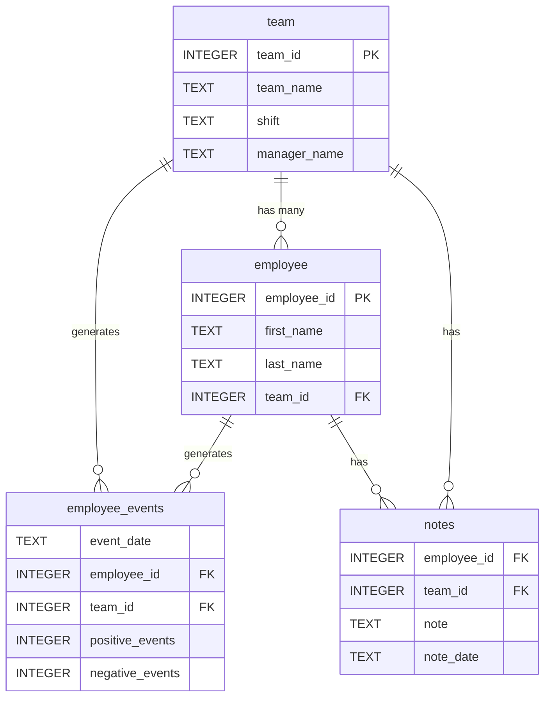

# Employee Performance and Retention Risk Dashboard

A production-ready data dashboard application designed for manufacturing companies to monitor employee performance metrics and predict recruitment risk using machine learning. This project demonstrates end-to-end MLOps practices including modular Python package development, interactive web dashboards, SQL-based data layers, and automated testing with CI/CD integration.

## Table of Contents

- [Project Overview](#project-overview)
- [Key Features](#key-features)
- [Technical Architecture](#technical-architecture)
- [Technology Stack](#technology-stack)
- [Project Structure](#project-structure)
- [Database Schema](#database-schema)
- [Installation](#installation)
- [Usage](#usage)
- [Testing](#testing)
- [Future Enhancements](#future-enhancements)

---

## Project Overview

### Problem Statement

Manufacturing companies face significant challenges in retaining high-performing employees. The cost of losing skilled workers to competitors includes recruitment expenses, training investments, and productivity losses. Managers need tools to:

1. **Monitor employee performance** through quantifiable positive and negative event metrics
2. **Identify at-risk employees** before they are recruited by competitors
3. **Track team-level trends** to address systemic issues

### Solution

This dashboard provides a comprehensive solution by combining:

- **Real-time performance visualization** with cumulative event tracking
- **Predictive analytics** using a trained Logistic Regression model to assess recruitment risk
- **Manager notes integration** for qualitative context alongside quantitative metrics
- **Dual-view capability** supporting both individual employee and team-level analysis

---

## Key Features

### Interactive Dashboard
- Built with FastHTML for lightweight, modern web interfaces
- Dynamic switching between Employee and Team views via radio buttons
- Dropdown-based entity selection with real-time dashboard updates

### Performance Visualization
- **Line Chart**: Displays cumulative positive and negative events over time
- **Bar Chart**: Shows predicted recruitment risk probability (0-100%)
- Responsive Matplotlib visualizations embedded as base64-encoded images

### Data Management
- **SQL Query Layer**: Modular Python package (`employee_events`) for database interactions
- **Manager Notes Table**: Chronological display of qualitative observations
- SQLite-based persistence for portability and simplicity

### Machine Learning Integration
- Pre-trained Logistic Regression model for recruitment risk prediction
- Aggregated positive/negative event counts as feature inputs
- Team-level predictions calculated as mean probability across team members

---

## Technical Architecture

```
┌─────────────────────────────────────────────────────────────────────────┐
│                           Web Layer (FastHTML)                          │
│  ┌──────────────┐  ┌──────────────┐  ┌──────────────┐  ┌─────────────┐  │
│  │    Header    │  │   Filters    │  │   Charts     │  │ Notes Table │  │
│  └──────────────┘  └──────────────┘  └──────────────┘  └─────────────┘  │
└─────────────────────────────────────────────────────────────────────────┘
                                    │
                                    ▼
┌─────────────────────────────────────────────────────────────────────────┐
│                      Component Architecture                             │
│  ┌────────────────────────┐    ┌────────────────────────────────────┐   │
│  │    BaseComponent       │    │      CombinedComponent             │   │
│  │  - Dropdown            │    │  - FormGroup (Radio + Dropdown)   │   │
│  │  - Radio               │    │  - Visualizations (Line + Bar)    │   │
│  │  - DataTable           │    │  - Report (Full Dashboard)        │   │
│  │  - MatplotlibViz       │    │                                    │   │
│  └────────────────────────┘    └────────────────────────────────────┘   │
└─────────────────────────────────────────────────────────────────────────┘
                                    │
                                    ▼
┌─────────────────────────────────────────────────────────────────────────┐
│                     Data Access Layer (employee_events)                 │
│  ┌──────────────┐  ┌──────────────┐  ┌──────────────────────────────┐   │
│  │   Employee   │  │     Team     │  │      QueryBase / Mixin       │   │
│  │  - names()   │  │  - names()   │  │  - event_counts()            │   │
│  │  - model_data│  │  - model_data│  │  - notes()                   │   │
│  └──────────────┘  └──────────────┘  │  - pandas_query() / query()  │   │
│                                      └──────────────────────────────┘   │
└─────────────────────────────────────────────────────────────────────────┘
                                    │
                                    ▼
┌─────────────────────────────────────────────────────────────────────────┐
│                          Persistence Layer                              │
│  ┌─────────────────────────────────────────────────────────────────┐    │
│  │                    SQLite (employee_events.db)                  │    │
│  │   employee │ team │ employee_events │ notes                     │    │
│  └─────────────────────────────────────────────────────────────────┘    │
└─────────────────────────────────────────────────────────────────────────┘
                                    │
                                    ▼
┌─────────────────────────────────────────────────────────────────────────┐
│                         ML Model (model.pkl)                            │
│              Logistic Regression - Recruitment Risk Prediction          │
└─────────────────────────────────────────────────────────────────────────┘
```

---

## Technology Stack

| Category | Technology | Purpose |
|----------|------------|---------|
| **Web Framework** | FastHTML | Lightweight Python web framework for interactive dashboards |
| **Database** | SQLite | Embedded relational database for portable data storage |
| **Machine Learning** | scikit-learn | Logistic Regression model for recruitment risk prediction |
| **Data Processing** | Pandas, NumPy | Data manipulation, aggregation, and feature engineering |
| **Visualization** | Matplotlib | Chart generation (line charts, bar charts) |
| **Statistical Modeling** | SciPy | Distribution functions for synthetic data generation |
| **Testing** | pytest | Unit testing framework with fixtures |
| **Code Quality** | flake8 | Linting and code style enforcement |
| **CI/CD** | GitHub Actions | Automated testing and deployment pipelines |

---

## Project Structure

```
employee-retention-dashboard/
│
├── assets/                          # Static assets
│   ├── model.pkl                    # Trained ML model (Logistic Regression)
│   └── report.css                   # Dashboard stylesheet
│
├── python-package/                  # Installable Python package
│   ├── setup.py                     # Package installation configuration
│   └── employee_events/             # Core package module
│       ├── __init__.py              # Package exports
│       ├── employee_events.db       # SQLite database
│       ├── sql_execution.py         # Query execution utilities
│       ├── query_base.py            # Base class with common queries
│       ├── employee.py              # Employee-specific queries
│       └── team.py                  # Team-specific queries
│
├── report/                          # Dashboard application
│   ├── dashboard.py                 # Main application entry point
│   ├── utils.py                     # Utility functions (model loading)
│   ├── base_components/             # Reusable UI components
│   │   ├── base_component.py        # Abstract base class
│   │   ├── dropdown.py              # Select dropdown component
│   │   ├── radio.py                 # Radio button group
│   │   ├── data_table.py            # HTML table renderer
│   │   └── matplotlib_viz.py        # Chart visualization component
│   └── combined_components/         # Composite UI components
│       ├── combined_component.py    # Container component
│       └── form_group.py            # Form wrapper with submit
│
├── src/                             # Data generation and build scripts
│   ├── build_project_assets.py      # Synthetic data and model generator
│   ├── utils.py                     # Path and color utilities
│   ├── crawl.yml                    # Docker Compose for ERD generation
│   └── generated_data/              # Source JSON files for mock data
│       ├── employees.json           # Employee profiles and notes
│       ├── managers.json            # Manager names
│       ├── shifts.json              # Shift schedules
│       └── team_names.json          # Team identifiers
│
├── tests/                           # Automated tests
│   └── test_employee_events.py      # Database and table existence tests
│
├── requirements.txt                 # Project dependencies
├── .gitignore                       # Git ignore patterns
├── LICENSE.txt                      # Udacity educational license
├── CODEOWNERS                       # GitHub code ownership
└── README.md                        # Project documentation
```

---

## Database Schema

The application uses a normalized SQLite database with four interconnected tables:



### Table Descriptions

| Table | Description |
|-------|-------------|
| **employee** | Core employee information including names and team assignment |
| **team** | Team metadata including name, shift schedule, and manager |
| **employee_events** | Daily performance metrics tracking positive and negative events |
| **notes** | Manager observations and comments with timestamps |

---

## Installation

### Prerequisites

- Python 3.9 or higher
- pip package manager
- Virtual environment (recommended)

### Setup Instructions

1. **Clone the repository**
   ```bash
   git clone https://github.com/yourusername/employee-retention-dashboard.git
   cd employee-retention-dashboard
   ```

2. **Create and activate virtual environment**
   ```bash
   python -m venv env
   source env/bin/activate  # On Windows: env\Scripts\activate
   ```

3. **Install dependencies**
   ```bash
   pip install -r requirements.txt
   ```

   This will also install the `employee_events` package in development mode.

4. **Verify installation**
   ```bash
   python -c "from employee_events import Employee, Team; print('Installation successful')"
   ```

---

## Usage

### Starting the Dashboard

```bash
cd report
python dashboard.py
```

The dashboard will be available at `http://localhost:5001`

### Available Routes

| Route | Description |
|-------|-------------|
| `/` | Default dashboard (Employee ID: 1) |
| `/employee/{id}` | Dashboard for specific employee |
| `/team/{id}` | Dashboard for specific team |

### Dashboard Features

1. **Toggle View**: Use the radio buttons to switch between Employee and Team views
2. **Select Entity**: Choose a specific employee or team from the dropdown
3. **View Metrics**: Analyze cumulative event trends in the line chart
4. **Assess Risk**: Review the predicted recruitment risk probability
5. **Read Notes**: Browse manager observations in the notes table

---

## Testing

### Running Tests

```bash
# Run all tests
pytest tests/ -v

# Run with coverage report
pytest tests/ --cov=python-package --cov-report=html
```

### Test Coverage

The test suite validates:

- Database file existence and accessibility
- Required table presence (employee, team, employee_events)
- Data integrity constraints

### Code Quality

```bash
# Run linting
flake8 python-package/ report/ --max-line-length=120
```

---

## Future Enhancements

### Planned Features

1. **Enhanced ML Pipeline**
   - Feature engineering with rolling averages and trend indicators
   - Model versioning with MLflow integration
   - A/B testing framework for model comparison

2. **Dashboard Improvements**
   - Real-time data updates via WebSocket connections
   - Export functionality for reports (PDF, CSV)
   - User authentication and role-based access control

3. **DevOps Integration**
   - Containerization with Docker
   - Kubernetes deployment manifests
   - Automated model retraining pipelines

4. **Advanced Analytics**
   - Cohort analysis for team performance
   - Anomaly detection for unusual event patterns
   - Retention prediction confidence intervals

---

## License

This project is licensed under the Creative Commons Attribution-NonCommercial-NoDerivs 3.0 License. See [LICENSE.txt](LICENSE.txt) for details.

---

## Acknowledgments

This project was developed as part of the Udacity MLOps curriculum, demonstrating practical applications of:
- Modular Python package development
- Interactive dashboard design
- Machine learning model integration
- Software engineering best practices
