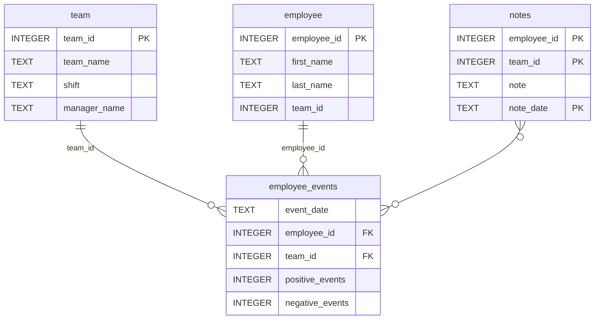

# Employee Performance & Retention Risk Dashboard

## 📌 Project Overview
The goal is to build a **data dashboard** for a manufacturing company’s managers to monitor employee performance and predict the likelihood of employees being recruited by competitors.  

The project includes:  
- A **Python package (`employee_events`)** that queries an SQLite database.  
- A **FastHTML-based dashboard** that visualizes employee or team performance.  
- A **machine learning model** integrated to predict employee recruitment risk.  
- **Automated tests with pytest** and GitHub Actions for CI/CD.  

---

## 🚀 Features
- 📊 **Interactive Dashboard** built with FastHTML  
- 👨‍💼 **Employee / Team View** toggle  
- 📝 **Notes Table**: Displays manager comments and observations  
- 📈 **Line Chart**: Shows cumulative positive and negative events over time  
- 📉 **Bar Chart**: Displays predicted recruitment risk using ML model  
- 🔍 **SQL Query Layer**: Queries employee/team data directly from `employee_events.db`  

---

### Repository Structure
```
├── README.md
├── assets
│   ├── model.pkl
│   └── report.css
├── env
├── python-package
│   ├── employee_events
│   │   ├── __init__.py
│   │   ├── employee.py
│   │   ├── employee_events.db
│   │   ├── query_base.py
│   │   ├── sql_execution.py
│   │   └── team.py
│   ├── requirements.txt
│   ├── setup.py
├── report
│   ├── base_components
│   │   ├── __init__.py
│   │   ├── base_component.py
│   │   ├── data_table.py
│   │   ├── dropdown.py
│   │   ├── matplotlib_viz.py
│   │   └── radio.py
│   ├── combined_components
│   │   ├── __init__.py
│   │   ├── combined_component.py
│   │   └── form_group.py
│   ├── dashboard.py
│   └── utils.py
├── requirements.txt
├── start
├── tests
    └── test_employee_events.py
```

### employee_events.db


